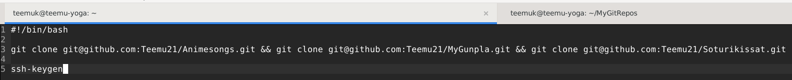
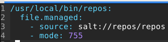
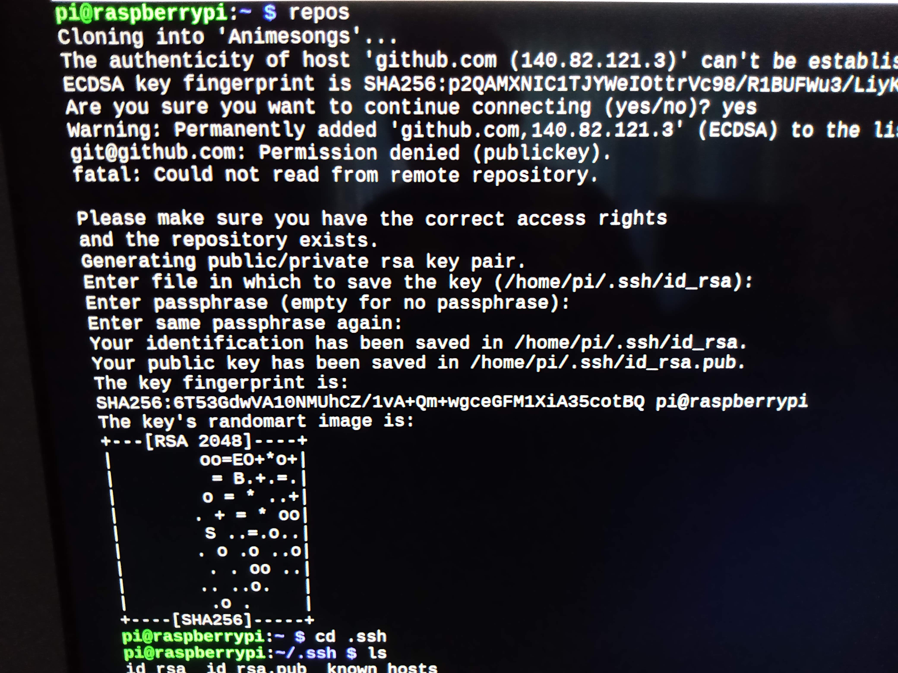
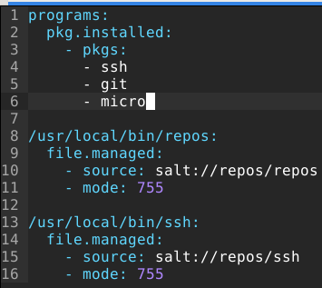
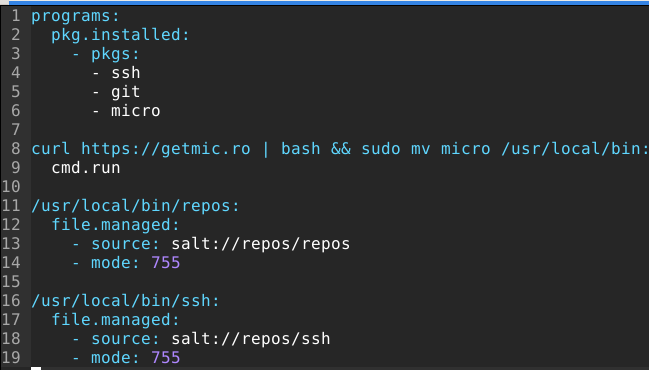
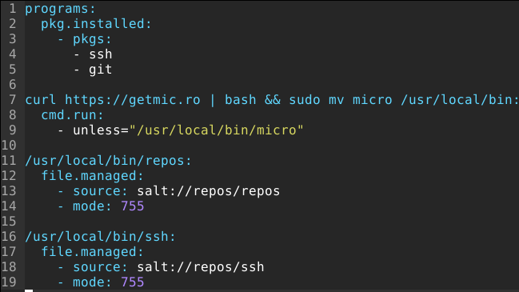
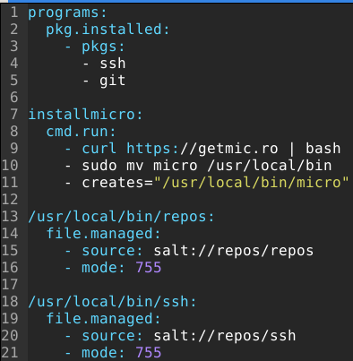
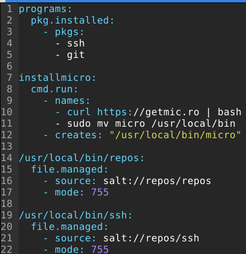
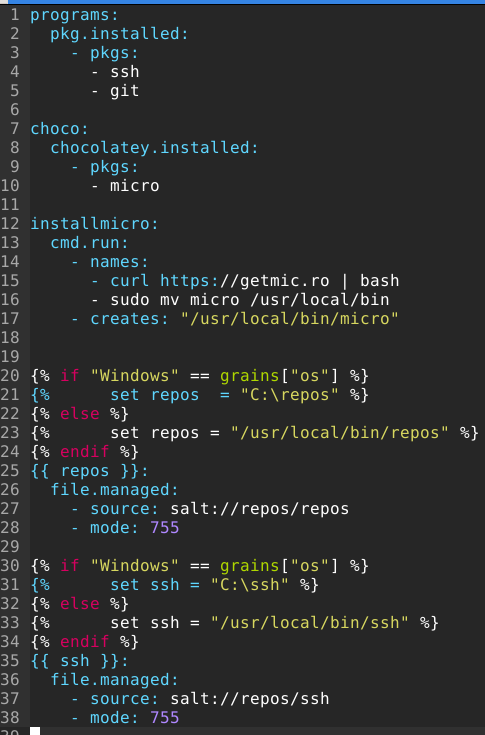
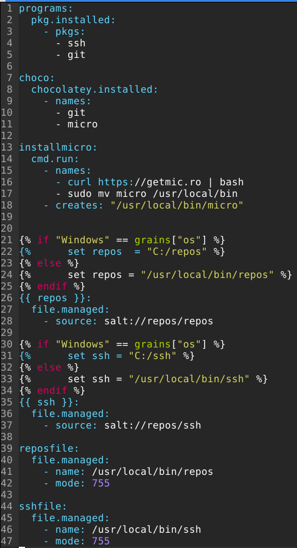

# H7 - Miniproject 

## By Teemu Koskinen

This file has all the steps how I accomplished this project and all the tests I did.

## Start 7.5.2022:

I will start this project by creating those three repositories I talked about before but I actually has to create just two because one of them already exist. 

The repositories that will be used in this project are Animesongs, Soturikissat and MyGunpla.

Let's test the main thing in this project that is the cloning multiple git repositories at the same time.

	$ git clone git@github.com:Teemu21/Animesongs.git git@github.com:Teemu21/Soturikissat.git git@github.com:Teemu21/MyGunpla.git
	
Let's test this.

	$ git clone git@github.com:Teemu21/Animesongs.git git@github.com:Teemu21/Soturikissat.git git@github.com:Teemu21/MyGunpla.git
	fatal: Too many arguments.
	
	usage: git clone [<options>] [--] <repo> [<dir>]
	
	    -v, --verbose         be more verbose
	    -q, --quiet           be more quiet
	    --progress            force progress reporting
	    -n, --no-checkout     don't create a checkout
	    --bare                create a bare repository
	    --mirror              create a mirror repository (implies bare)
	    -l, --local           to clone from a local repository
	    --no-hardlinks        don't use local hardlinks, always copy
	    -s, --shared          setup as shared repository
	    --recurse-submodules[=<pathspec>]
	                          initialize submodules in the clone
	    --recursive ...       alias of --recurse-submodules
	    -j, --jobs <n>        number of submodules cloned in parallel
	    --template <template-directory>
	                          directory from which templates will be used
	    --reference <repo>    reference repository
	    --reference-if-able <repo>
	                          reference repository
	    --dissociate          use --reference only while cloning
	    -o, --origin <name>   use <name> instead of 'origin' to track upstream
	    -b, --branch <branch>
	                          checkout <branch> instead of the remote's HEAD
	    -u, --upload-pack <path>
	                          path to git-upload-pack on the remote
	    --depth <depth>       create a shallow clone of that depth
	    --shallow-since <time>
	                          create a shallow clone since a specific time
	    --shallow-exclude <revision>
	                          deepen history of shallow clone, excluding rev
	    --single-branch       clone only one branch, HEAD or --branch
	    --no-tags             don't clone any tags, and make later fetches not to follow them
	    --shallow-submodules  any cloned submodules will be shallow
	    --separate-git-dir <gitdir>
	                          separate git dir from working tree
	    -c, --config <key=value>
	                          set config inside the new repository
	    --server-option <server-specific>
	                          option to transmit
	    -4, --ipv4            use IPv4 addresses only
	    -6, --ipv6            use IPv6 addresses only
	    --filter <args>       object filtering
	    --remote-submodules   any cloned submodules will use their remote-tracking branch
	    --sparse              initialize sparse-checkout file to include only files at root

Seems like that cloning multiple repositories even bt hand isn't as easy as I thought it would be.

After looking info in the internet I found out that you have to use && git clone to clone multiple git repositories in their own directories.

	$ git clone git@github.com:Teemu21/Animesongs.git && git clone git@github.com:Teemu21/Soturikissat.git && git clone git@github.com:Teemu21/MyGunpla.git
	Cloning into 'Animesongs'...
	remote: Enumerating objects: 276, done.
	remote: Counting objects: 100% (119/119), done.
	remote: Compressing objects: 100% (80/80), done.
	remote: Total 276 (delta 78), reused 80 (delta 39), pack-reused 157
	Receiving objects: 100% (276/276), 34.40 KiB | 617.00 KiB/s, done.
	Resolving deltas: 100% (179/179), done.
	Cloning into 'Soturikissat'...
	remote: Enumerating objects: 4, done.
	remote: Counting objects: 100% (4/4), done.
	remote: Compressing objects: 100% (4/4), done.
	remote: Total 4 (delta 0), reused 0 (delta 0), pack-reused 0
	Receiving objects: 100% (4/4), 7.40 KiB | 7.40 MiB/s, done.
	Cloning into 'MyGunpla'...
	remote: Enumerating objects: 4, done.
	remote: Counting objects: 100% (4/4), done.
	remote: Compressing objects: 100% (4/4), done.
	remote: Total 4 (delta 0), reused 0 (delta 0), pack-reused 0
	Receiving objects: 100% (4/4), 7.37 KiB | 7.37 MiB/s, done.
	$ ls
	 Animesongs      Desktop     Downloads   hello.py    jerryngittesti   Music        MyGunpla   Projekti2   Soturikissat   teemu2.txt   Templates            Videos
	 apachemoduuli   Documents   hello       important   Linux-HomeWork   MyGitRepos   Pictures   Public      teemu          teemuntyö   'UFW Salt tila.png'

This way it seems to be working but I also found out about the program called repo that's suppose to help with multiple git repositories. I tried to install this "repo" program but I couldn't get it to work. 

## 13.5.2022:

Now that the main thing of this project can be done by hand let's try to make the Salt state of this command. I went to [Salt's](https://docs.saltproject.io/en/latest/ref/states/all/salt.states.cmd.html) own site to find info about cmd.run because I wanted to test how I could make git clone command an Salt state that doesn't change if I run it second time and I found about stateful argument that I believe will make it so that it won't try to clone my git repos again. My init.sls file looks like this:

 

Let's test this state.

After testing this state I realized that it was useless because for some reason using Salt to clone git repo by SSH causes Permission Denied (publickey) error and after few hours looking into it I couldn't find any solution to this problem. Then I tried to clone it by using Git HTTPS and it kinda worked. I managed to clone the repository but it had wrong permissions. Basically only root user could do anything in that github repo. This was a big problem because after lot of trial and error I realized that even mode 777 in init.sls file didn't change the permissions. Then I tried to change them by hand and surprise surprise chmod worked but when I tried git add . command without sudo it gave me permission denied error. After this I realized that only way forward in this project was a shell script that would be runned on the minion manually after copying it from master to minions. Then the problem arose. How to run shell scripts on Windows? After a while I found a solution. Install Linux on Windows and I found perfect guide to it from [FOSS](https://itsfoss.com/install-bash-on-windows/). This guide is bit old if you are using Windows 11 but it works on it too. Tomorrow if I have time I will install Salt on my Ubuntu on Windows and day would be 14.5.2022.  

## 15.5.2022:

After running issues making Windows Subsystem for Linux to Salt minion. I realized that with WSL and Ubuntu installed that I could now use bash in normal Windows as well making in easy to copy and use shell scripts on Windows. FOSS guide for installing WSL and Ubuntu is good but to use git for cloning you will have to install SSH on your WSL machine and run ssh-keygen command. After this add your WSL machine's publickey to your Github. Otherwise it gives permission denied (publickey) error when trying to clone something by using shell script on Windows. These issues with Salt minion were there because my Salt master is in homenetwork which works in every situaion if all your minions are connected to same network but WSL has it's own virtual network so my master couldn't never find it and I tried change in it but it resulted in no connection to internet on the WSL machine. If your master is in an actual public ip address then Salt minion should work just fine. 

Now that bash issue on Windows has been solved. I can now make that shell script that will be copied to all minions.

Let's test this command.

	$ bash repos
	Cloning into 'Animesongs'...
	remote: Enumerating objects: 276, done.
	remote: Counting objects: 100% (119/119), done.
	remote: Compressing objects: 100% (80/80), done.
	remote: Total 276 (delta 78), reused 80 (delta 39), pack-reused 157
	Receiving objects: 100% (276/276), 34.39 KiB | 463.00 KiB/s, done.
	Resolving deltas: 100% (179/179), done.
	Cloning into 'MyGunpla'...
	remote: Enumerating objects: 4, done.
	remote: Counting objects: 100% (4/4), done.
	remote: Compressing objects: 100% (4/4), done.
	remote: Total 4 (delta 0), reused 0 (delta 0), pack-reused 0
	Receiving objects: 100% (4/4), 7.37 KiB | 7.37 MiB/s, done.
	Cloning into 'Soturikissat'...
	remote: Enumerating objects: 4, done.
	remote: Counting objects: 100% (4/4), done.
	remote: Compressing objects: 100% (4/4), done.
	remote: Total 4 (delta 0), reused 0 (delta 0), pack-reused 0
	Receiving objects: 100% (4/4), 7.40 KiB | 3.70 MiB/s, done.
	Generating public/private rsa key pair.
	Enter file in which to save the key (/home/teemuk/.ssh/id_rsa): 
	/home/teemuk/.ssh/id_rsa already exists.
	Overwrite (y/n)? n

Command seems to work fine but I didn't want it to overwrite old key so I typed n.

Time to test this command on a minion but first I will have to edit the old init.sls file that I created earlier.

Modified init.sls:

Now I can test the command.

This command is succesful but it doesn't clone the repositories and ssh-keygen asks user input to work.

Maybe I could run ssh-keygen with cmd.run. 

	$ sudo salt "raspberrypi" state.single cmd.run "cd /home/pi && ssh-keygen" stdin='\ \' 
	   raspberrypi:
	   ----------
	             ID: cd /home/pi && ssh-keygen
	       Function: cmd.run
	         Result: True
	        Comment: Command "cd /home/pi && ssh-keygen" run
	        Started: 15:18:37.681675
	       Duration: 1465.343 ms
	        Changes:   
	                 ----------
	                 pid:
	                     2031
	                 retcode:
	                     0
	                 stderr:
	                     Enter passphrase (empty for no passphrase): Enter same passphrase again:
	                 stdout:
	                     Generating public/private rsa key pair.
	                     Enter file in which to save the key (/root/.ssh/id_rsa): Your identification has been saved in \ \.
	                     Your public key has been saved in \ \.pub.
	                     The key fingerprint is:
	                     SHA256:or+Smr7VyB3qHaIy2iMV3+YWFmjs65AJuBeyCubNL8Q root@raspberrypi
	                     The key's randomart image is:
	                     +---[RSA 2048]----+
	                     |                 |
	                     |                 |
	                     |   . .           |
	                     |. . + .          |
	                     |+ o= .o.S        |
	                     | =.Eo*=o         |
	                     |+o* B*+.         |
	                     |Oo+B++o.         |
	                     |+*BB=++.         |
	                     +----[SHA256]-----+
	      

This was actually one the later tries to get this working but Salt always runs commands as root and I can't change them so I will have to give up this idea for automating ssh-keygen. Apparently I will have to make two shell scripts were one runs ssh-keygen and other clones the git repositories.

Newly modified init.sls:

This command should now run on any Linux disto. Let's test it.

	$ sudo salt "raspberrypi" state.apply repos
	raspberrypi:
	----------
	          ID: programs
	    Function: pkg.installed
	      Result: False
	     Comment: Problem encountered installing package(s). Additional info follows:
	              
	              errors:
	                  - Running scope as unit: run-rcbb4179bf3c34d55b4b8e836415cc446.scope
	                    E: Unable to locate package micro
	     Started: 18:44:43.343777
	    Duration: 6236.108 ms
	     Changes:   
	----------
	          ID: /usr/local/bin/repos
	    Function: file.managed
	      Result: True
	     Comment: File /usr/local/bin/repos updated
	     Started: 18:44:49.589683
	    Duration: 165.207 ms
	     Changes:   
	              ----------
	              diff:
	                  New file
	              mode:
	                  0755
	----------
	          ID: /usr/local/bin/ssh
	    Function: file.managed
	      Result: True
	     Comment: File /usr/local/bin/ssh updated
	     Started: 18:44:49.755286
	    Duration: 34.868 ms
	     Changes:   
	              ----------
	              diff:
	                  New file
	              mode:
	                  0755
	
	Summary for raspberrypi
	------------
	Succeeded: 2 (changed=2)
	Failed:    1
	------------
	Total states run:     3
	Total run time:   6.436 s
	ERROR: Minions returned with non-zero exit code
	
This state seems to work but Raspberry Pi didn't find the Micro from Raspberry Pi APT repository. Let's modify the init.sls again. While I tested that both shell scripts were working I realized that if I runned ssh first git could get error because it remembered what last command was and got wrong starting leters error. For me it was gene like from generating RSA keys... 

init.sls:

Let's test.

	$ sudo salt "raspberrypi" state.apply repos
	raspberrypi:
	----------
	          ID: programs
	    Function: pkg.installed
	      Result: True
	     Comment: All specified packages are already installed
	     Started: 19:01:32.851125
	    Duration: 243.325 ms
	     Changes:   
	----------
	          ID: curl https://getmic.ro | bash && sudo mv micro /usr/local/bin
	    Function: cmd.run
	      Result: True
	     Comment: Command "curl https://getmic.ro | bash && sudo mv micro /usr/local/bin" run
	     Started: 19:01:33.101008
	    Duration: 3080.277 ms
	     Changes:   
	              ----------
	              pid:
	                  4038
	              retcode:
	                  0
	              stderr:
	                    % Total    % Received % Xferd  Average Speed   Time    Time     Time  Current
	                                                   Dload  Upload   Total   Spent    Left  Speed
	                  
	                    0     0    0     0    0     0      0      0 --:--:-- --:--:-- --:--:--     0
	                    0     0    0     0    0     0      0      0 --:--:-- --:--:-- --:--:--     0
	                  100  9898  100  9898    0     0  28442      0 --:--:-- --:--:-- --:--:-- 28361
	                    % Total    % Received % Xferd  Average Speed   Time    Time     Time  Current
	                                                   Dload  Upload   Total   Spent    Left  Speed
	                  
	                    0     0    0     0    0     0      0      0 --:--:-- --:--:-- --:--:--     0
	                    0     0    0     0    0     0      0      0 --:--:-- --:--:-- --:--:--     0
	                    0     0    0     0    0     0      0      0 --:--:-- --:--:-- --:--:--     0
	                  
	                   57 4072k   57 2351k    0     0  1864k      0  0:00:02  0:00:01  0:00:01 1864k
	                  100 4072k  100 4072k    0     0  2226k      0  0:00:01  0:00:01 --:--:-- 3035k
	              stdout:
	                  Detected platform: linux-arm
	                  Latest Version: 2.0.10
	                  Downloading https://github.com/zyedidia/micro/releases/download/v2.0.10/micro-2.0.10-linux-arm.tar.gz
	                  micro-2.0.10/micro
	                  
	                  
	                   __  __ _                  ___           _        _ _          _ _
	                  |  \/  (_) ___ _ __ ___   |_ _|_ __  ___| |_ __  | | | ___  __| | |
	                  | |\/| | |/ __| '__/ _ \   | || '_ \/ __| __/ _\ | | |/ _ \/ _  | |
	                  | |  | | | (__| | | (_) |  | || | | \__ \ || (_| | | |  __/ (_| |_|
	                  |_|  |_|_|\___|_|  \___/  |___|_| |_|___/\__\__,_|_|_|\___|\__,_(_)
	                  
	                  Micro has been downloaded to the current directory.
	                  You can run it with:
	                  
	                  ./micro
	----------
	          ID: /usr/local/bin/repos
	    Function: file.managed
	      Result: True
	     Comment: File /usr/local/bin/repos is in the correct state
	     Started: 19:01:36.191344
	    Duration: 156.059 ms
	     Changes:   
	----------
	          ID: /usr/local/bin/ssh
	    Function: file.managed
	      Result: True
	     Comment: File /usr/local/bin/ssh is in the correct state
	     Started: 19:01:36.347834
	    Duration: 36.743 ms
	     Changes:   
	
	Summary for raspberrypi
	------------
	Succeeded: 4 (changed=1)
	Failed:    0
	------------
	Total states run:     4
	Total run time:   3.516 s

Of course this isn't idempotence yet but at least we now have a Micro installed.

Let's make this beta state an idempotence.

Let's try this.

Well, Salt said my cmd.run had too many functions so I change it a litle.

This didn't work either but this one finally worked and now I have idempotence.

	$ sudo salt "raspberrypi" state.apply repos
	raspberrypi:
	----------
	          ID: programs
	    Function: pkg.installed
	      Result: True
	     Comment: All specified packages are already installed
	     Started: 20:01:21.050158
	    Duration: 248.647 ms
	     Changes:   
	----------
	          ID: installmicro
	    Function: cmd.run
	        Name: curl https://getmic.ro
	      Result: True
	     Comment: /usr/local/bin/micro exists
	     Started: 20:01:21.305174
	    Duration: 1566.324 ms
	     Changes:   
	----------
	          ID: installmicro
	    Function: cmd.run
	        Name: sudo mv micro /usr/local/bin
	      Result: True
	     Comment: /usr/local/bin/micro exists
	     Started: 20:01:22.872027
	    Duration: 24.56 ms
	     Changes:   
	----------
	          ID: /usr/local/bin/repos
	    Function: file.managed
	      Result: True
	     Comment: File /usr/local/bin/repos is in the correct state
	     Started: 20:01:22.896990
	    Duration: 184.405 ms
	     Changes:   
	----------
	          ID: /usr/local/bin/ssh
	    Function: file.managed
	      Result: True
	     Comment: File /usr/local/bin/ssh is in the correct state
	     Started: 20:01:23.081790
	    Duration: 32.029 ms
	     Changes:   
	
	Summary for raspberrypi
	------------
	Succeeded: 5
	Failed:    0
	------------
	Total states run:     5
	Total run time:   2.056 s
	
Now that Micro works I think that let's call it a day and continue tomorrow. Now the Linux part of this project is done. Tomorrow I will make this to work on the Windows too.

## 16.5.2022:

Let's start testing this on Windows by first modifying the init.sls file.

New init.sls:

For this configuration I used Tero Karvinen's [Configure Windows and Linux with Single Salt Module](https://terokarvinen.com/2018/configure-windows-and-linux-with-salt-jinja-if-else-and-grains/?fromSearch=windows%20linux%20salt) and [Control Windows with Salt](https://terokarvinen.com/2018/control-windows-with-salt/) articles as reference. Let's test this.

After tweaking the init.sls file litle I finally got it working with some expected and unexpected errors because I'm running it now only on Windows slave.

	$ sudo salt "windows" state.apply repos
	windows:
	----------
	          ID: programs
	    Function: pkg.installed
	      Result: False
	     Comment: The following packages failed to install/update: ssh, git
	     Started: 09:33:42.234448
	    Duration: 298.151 ms
	     Changes:   
	              ----------
	              git:
	                  Unable to locate package git
	              ssh:
	                  Unable to locate package ssh
	----------
	          ID: choco
	    Function: chocolatey.installed
	        Name: micro
	      Result: True
	     Comment: micro 2.0.10 is already installed
	     Started: 09:33:42.532599
	    Duration: 9103.427 ms
	     Changes:   
	----------
	          ID: installmicro
	    Function: cmd.run
	        Name: curl https://getmic.ro | bash
	      Result: False
	     Comment: Command "curl https://getmic.ro | bash" run
	     Started: 09:33:51.636026
	    Duration: 4250.854 ms
	     Changes:   
	              ----------
	              pid:
	                  27140
	              retcode:
	                  1
	              stderr:
	                    % Total    % Received % Xferd  Average Speed   Time    Time     Time  Current
	                                                   Dload  Upload   Total   Spent    Left  Speed
	                  
	                    0     0    0     0    0     0      0      0 --:--:-- --:--:-- --:--:--     0Access is denied.
	                  
	                  
	                  
	                    0     0    0     0    0     0      0      0 --:--:-- --:--:-- --:--:--     0
	                  100  9898  100  9898    0     0  12375      0 --:--:-- --:--:-- --:--:-- 12387
	                  curl: (23) Failure writing output to destination
	              stdout:
	----------
	          ID: installmicro
	    Function: cmd.run
	        Name: sudo mv micro /usr/local/bin
	      Result: False
	     Comment: Command "sudo mv micro /usr/local/bin" run
	     Started: 09:33:55.886880
	    Duration: 15.657 ms
	     Changes:   
	              ----------
	              pid:
	                  4960
	              retcode:
	                  1
	              stderr:
	                  'sudo' is not recognized as an internal or external command,
	                  operable program or batch file.
	              stdout:
	----------
	          ID: C:/repos
	    Function: file.managed
	      Result: False
	     Comment: The 'mode' option is not supported on Windows
	     Started: 09:33:55.902537
	    Duration: 0.0 ms
	     Changes:   
	----------
	          ID: C:/ssh
	    Function: file.managed
	      Result: False
	     Comment: The 'mode' option is not supported on Windows
	     Started: 09:33:55.902537
	    Duration: 0.0 ms
	     Changes:   
	
	Summary for windows
	------------
	Succeeded: 1 (changed=3)
	Failed:    5
	------------
	Total states run:     6
	Total run time:  13.668 s
	ERROR: Minions returned with non-zero exit code

For some strange reason Windows couldn't find git from Windows repository but that can be fixed with choco. I could also make second file.managed state that changes the mode to 755 which apparently doesn't work on Windows.

Let's modify the init.sls.

I modified the choco install litle bit so now it's:

	names:
	 - git
	 - micro 

Unlike in the in the picture above and this was the test result:

	$ sudo salt "windows" state.apply repos
	 windows:
	 ----------
	           ID: programs
	     Function: pkg.installed
	       Result: False
	      Comment: The following packages failed to install/update: ssh, git
	      Started: 10:02:05.149046
	     Duration: 2840.914 ms
	      Changes:   
	               ----------
	               git:
	                   Unable to locate package git
	               ssh:
	                   Unable to locate package ssh
	 ----------
	           ID: choco
	     Function: chocolatey.installed
	         Name: git
	       Result: True
	      Comment: git 2.36.0 is already installed
	      Started: 10:02:07.989960
	     Duration: 6183.406 ms
	      Changes:   
	 ----------
	           ID: choco
	     Function: chocolatey.installed
	         Name: micro
	       Result: True
	      Comment: micro 2.0.10 is already installed
	      Started: 10:02:14.173366
	     Duration: 3738.598 ms
	      Changes:   
	 ----------
	           ID: installmicro
	     Function: cmd.run
	         Name: curl https://getmic.ro | bash
	       Result: False
	      Comment: Command "curl https://getmic.ro | bash" run
	      Started: 10:02:17.911964
	     Duration: 3453.073 ms
	      Changes:   
	               ----------
	               pid:
	                   24316
	               retcode:
	                   1
	               stderr:
	                     % Total    % Received % Xferd  Average Speed   Time    Time     Time  Current
	                                                    Dload  Upload   Total   Spent    Left  Speed
	                   
	                     0     0    0     0    0     0      0      0 --:--:-- --:--:-- --:--:--     0Access is denied.
	                   
	                   
	                   
	                     0  9898    0     0    0     0      0      0 --:--:-- --:--:-- --:--:--     0
	                   100  9898  100  9898    0     0  24948      0 --:--:-- --:--:-- --:--:-- 24994
	                   curl: (23) Failure writing output to destination
	               stdout:
	 ----------
	           ID: installmicro
	     Function: cmd.run
	         Name: sudo mv micro /usr/local/bin
	       Result: False
	      Comment: Command "sudo mv micro /usr/local/bin" run
	      Started: 10:02:21.365037
	     Duration: 15.62 ms
	      Changes:   
	               ----------
	               pid:
	                   26552
	               retcode:
	                   1
	               stderr:
	                   'sudo' is not recognized as an internal or external command,
	                   operable program or batch file.
	               stdout:
	 ----------
	           ID: C:/repos
	     Function: file.managed
	       Result: True
	      Comment: File C:/repos is in the correct state
	      Started: 10:02:21.380657
	     Duration: 112.88 ms
	      Changes:   
	 ----------
	           ID: C:/ssh
	     Function: file.managed
	       Result: True
	      Comment: File C:/ssh is in the correct state
	      Started: 10:02:21.493537
	     Duration: 13.166 ms
	      Changes:   
	 ----------
	           ID: /usr/local/bin/repos && /usr/local/bin/ssh
	     Function: file.managed
	       Result: False
	      Comment: The 'mode' option is not supported on Windows
	      Started: 10:02:21.506703
	     Duration: 0.0 ms
	      Changes:   
	 
	 Summary for windows
	 ------------
	 Succeeded: 4 (changed=3)
	 Failed:    4
	 ------------
	 Total states run:     8
	 Total run time:  16.358 s
	 ERROR: Minions returned with non-zero exit code

After checking on my Windows machine I found files named repos and ssh in my C:/ directory. Then I runned the bash repos and it cloned my repos in the C directory.

Now my project is complete but I must still do one final test with both Linux and Windows machines online. So, let's finish this!

Before the final test I removed ssh and repos directories on Windows. On the Raspberrypi I purged git and ssh. After this deleted the repos, ssh and micro directories from /usr/local/bin.

	$ sudo salt "*" state.apply repos
	windows:
	----------
	          ID: programs
	    Function: pkg.installed
	      Result: False
	     Comment: The following packages failed to install/update: ssh, git
	     Started: 10:25:01.433471
	    Duration: 329.404 ms
	     Changes:   
	              ----------
	              git:
	                  Unable to locate package git
	              ssh:
	                  Unable to locate package ssh
	----------
	          ID: choco
	    Function: chocolatey.installed
	        Name: git
	      Result: True
	     Comment: git 2.36.0 is already installed
	     Started: 10:25:01.762875
	    Duration: 3843.348 ms
	     Changes:   
	----------
	          ID: choco
	    Function: chocolatey.installed
	        Name: micro
	      Result: True
	     Comment: micro 2.0.10 is already installed
	     Started: 10:25:05.606223
	    Duration: 3767.092 ms
	     Changes:   
	----------
	          ID: installmicro
	    Function: cmd.run
	        Name: curl https://getmic.ro | bash
	      Result: False
	     Comment: Command "curl https://getmic.ro | bash" run
	     Started: 10:25:09.388795
	    Duration: 3955.112 ms
	     Changes:   
	              ----------
	              pid:
	                  29028
	              retcode:
	                  1
	              stderr:
	                    % Total    % Received % Xferd  Average Speed   Time    Time     Time  Current
	                                                   Dload  Upload   Total   Spent    Left  Speed
	                  
	                    0     0    0     0    0     0      0      0 --:--:-- --:--:-- --:--:--     0Access is denied.
	                  
	                  
	                  
	                    0     0    0     0    0     0      0      0 --:--:-- --:--:-- --:--:--     0
	                  100  9898  100  9898    0     0  22430      0 --:--:-- --:--:-- --:--:-- 22806
	                  curl: (23) Failure writing output to destination
	              stdout:
	----------
	          ID: installmicro
	    Function: cmd.run
	        Name: sudo mv micro /usr/local/bin
	      Result: False
	     Comment: Command "sudo mv micro /usr/local/bin" run
	     Started: 10:25:13.343907
	    Duration: 31.265 ms
	     Changes:   
	              ----------
	              pid:
	                  19556
	              retcode:
	                  1
	              stderr:
	                  'sudo' is not recognized as an internal or external command,
	                  operable program or batch file.
	              stdout:
	----------
	          ID: C:/repos
	    Function: file.managed
	      Result: True
	     Comment: File C:/repos updated
	     Started: 10:25:13.375172
	    Duration: 94.151 ms
	     Changes:   
	              ----------
	              diff:
	                  New file
	----------
	          ID: C:/ssh
	    Function: file.managed
	      Result: True
	     Comment: File C:/ssh updated
	     Started: 10:25:13.469323
	    Duration: 46.879 ms
	     Changes:   
	              ----------
	              diff:
	                  New file
	----------
	          ID: /usr/local/bin/repos && /usr/local/bin/ssh
	    Function: file.managed
	      Result: False
	     Comment: The 'mode' option is not supported on Windows
	     Started: 10:25:13.516202
	    Duration: 0.0 ms
	     Changes:   
	
	Summary for windows
	------------
	Succeeded: 4 (changed=5)
	Failed:    4
	------------
	Total states run:     8
	Total run time:  12.067 s
	raspberrypi:
	----------
	          ID: programs
	    Function: pkg.installed
	      Result: True
	     Comment: The following packages were installed/updated: ssh, git
	     Started: 10:25:08.723321
	    Duration: 16797.901 ms
	     Changes:   
	              ----------
	              git:
	                  ----------
	                  new:
	                      1:2.20.1-2+deb10u3
	                  old:
	              ssh:
	                  ----------
	                  new:
	                      1:7.9p1-10+deb10u2+rpt1
	                  old:
	----------
	          ID: choco
	    Function: chocolatey.installed
	        Name: git
	      Result: False
	     Comment: State 'chocolatey.installed' was not found in SLS 'repos'
	              Reason: 'chocolatey' __virtual__ returned False: chocolatey module could not be loaded
	     Changes:   
	----------
	          ID: choco
	    Function: chocolatey.installed
	        Name: micro
	      Result: False
	     Comment: State 'chocolatey.installed' was not found in SLS 'repos'
	              Reason: 'chocolatey' __virtual__ returned False: chocolatey module could not be loaded
	     Changes:   
	----------
	          ID: installmicro
	    Function: cmd.run
	        Name: curl https://getmic.ro | bash
	      Result: True
	     Comment: Command "curl https://getmic.ro | bash" run
	     Started: 10:25:32.511809
	    Duration: 4912.91 ms
	     Changes:   
	              ----------
	              pid:
	                  1994
	              retcode:
	                  0
	              stderr:
	                    % Total    % Received % Xferd  Average Speed   Time    Time     Time  Current
	                                                   Dload  Upload   Total   Spent    Left  Speed
	                  
	                    0     0    0     0    0     0      0      0 --:--:-- --:--:-- --:--:--     0
	                  100  9898  100  9898    0     0  15711      0 --:--:-- --:--:-- --:--:-- 15711
	                    % Total    % Received % Xferd  Average Speed   Time    Time     Time  Current
	                                                   Dload  Upload   Total   Spent    Left  Speed
	                  
	                    0     0    0     0    0     0      0      0 --:--:-- --:--:-- --:--:--     0
	                    0     0    0     0    0     0      0      0 --:--:-- --:--:-- --:--:--     0
	                    0     0    0     0    0     0      0      0 --:--:-- --:--:-- --:--:--     0
	                  
	                    0     0    0     0    0     0      0      0 --:--:--  0:00:01 --:--:--     0
	                   35 4072k   35 1446k    0     0   685k      0  0:00:05  0:00:02  0:00:03 1562k
	                  100 4072k  100 4072k    0     0  1464k      0  0:00:02  0:00:02 --:--:-- 2548k
	              stdout:
	                  Detected platform: linux-arm
	                  Latest Version: 2.0.10
	                  Downloading https://github.com/zyedidia/micro/releases/download/v2.0.10/micro-2.0.10-linux-arm.tar.gz
	                  micro-2.0.10/micro
	                  
	                  
	                   __  __ _                  ___           _        _ _          _ _
	                  |  \/  (_) ___ _ __ ___   |_ _|_ __  ___| |_ __  | | | ___  __| | |
	                  | |\/| | |/ __| '__/ _ \   | || '_ \/ __| __/ _\ | | |/ _ \/ _  | |
	                  | |  | | | (__| | | (_) |  | || | | \__ \ || (_| | | |  __/ (_| |_|
	                  |_|  |_|_|\___|_|  \___/  |___|_| |_|___/\__\__,_|_|_|\___|\__,_(_)
	                  
	                  Micro has been downloaded to the current directory.
	                  You can run it with:
	                  
	                  ./micro
	----------
	          ID: installmicro
	    Function: cmd.run
	        Name: sudo mv micro /usr/local/bin
	      Result: True
	     Comment: Command "sudo mv micro /usr/local/bin" run
	     Started: 10:25:37.425525
	    Duration: 64.835 ms
	     Changes:   
	              ----------
	              pid:
	                  2027
	              retcode:
	                  0
	              stderr:
	              stdout:
	----------
	          ID: /usr/local/bin/repos
	    Function: file.managed
	      Result: True
	     Comment: File /usr/local/bin/repos updated
	     Started: 10:25:37.491196
	    Duration: 84.053 ms
	     Changes:   
	              ----------
	              diff:
	                  New file
	              mode:
	                  0644
	----------
	          ID: /usr/local/bin/ssh
	    Function: file.managed
	      Result: True
	     Comment: File /usr/local/bin/ssh updated
	     Started: 10:25:37.575658
	    Duration: 37.097 ms
	     Changes:   
	              ----------
	              diff:
	                  New file
	              mode:
	                  0644
	----------
	          ID: /usr/local/bin/repos && /usr/local/bin/ssh
	    Function: file.managed
	      Result: False
	     Comment: Parent directory not present
	     Started: 10:25:37.613169
	    Duration: 4.793 ms
	     Changes:   
	
	Summary for raspberrypi
	------------
	Succeeded: 5 (changed=5)
	Failed:    3
	------------
	Total states run:     8
	Total run time:  21.902 s
	ERROR: Minions returned with non-zero exit code

Apparently file.managed cannot work with && statement so let's change init.sls because right now I can run neither repos or ssh commands on Raspberry Pi.

Final version of init.sls file:

Let's test.

	$ sudo salt "*" state.apply repos
		raspberrypi:
		----------
		          ID: programs
		    Function: pkg.installed
		      Result: True
		     Comment: All specified packages are already installed
		     Started: 10:39:39.282141
		    Duration: 240.247 ms
		     Changes:   
		----------
		          ID: choco
		    Function: chocolatey.installed
		        Name: git
		      Result: False
		     Comment: State 'chocolatey.installed' was not found in SLS 'repos'
		              Reason: 'chocolatey' __virtual__ returned False: chocolatey module could not be loaded
		     Changes:   
		----------
		          ID: choco
		    Function: chocolatey.installed
		        Name: micro
		      Result: False
		     Comment: State 'chocolatey.installed' was not found in SLS 'repos'
		              Reason: 'chocolatey' __virtual__ returned False: chocolatey module could not be loaded
		     Changes:   
		----------
		          ID: installmicro
		    Function: cmd.run
		        Name: curl https://getmic.ro | bash
		      Result: True
		     Comment: /usr/local/bin/micro exists
		     Started: 10:39:40.850549
		    Duration: 24.302 ms
		     Changes:   
		----------
		          ID: installmicro
		    Function: cmd.run
		        Name: sudo mv micro /usr/local/bin
		      Result: True
		     Comment: /usr/local/bin/micro exists
		     Started: 10:39:40.875291
		    Duration: 23.3 ms
		     Changes:   
		----------
		          ID: /usr/local/bin/repos
		    Function: file.managed
		      Result: True
		     Comment: File /usr/local/bin/repos is in the correct state
		     Started: 10:39:40.899001
		    Duration: 148.51 ms
		     Changes:   
		----------
		          ID: /usr/local/bin/ssh
		    Function: file.managed
		      Result: True
		     Comment: File /usr/local/bin/ssh is in the correct state
		     Started: 10:39:41.047911
		    Duration: 67.163 ms
		     Changes:   
		----------
		          ID: reposfile
		    Function: file.managed
		        Name: /usr/local/bin/repos
		      Result: True
		     Comment: 
		     Started: 10:39:41.115469
		    Duration: 4.866 ms
		     Changes:   
		              ----------
		              mode:
		                  0755
		----------
		          ID: sshfile
		    Function: file.managed
		        Name: /usr/local/bin/ssh
		      Result: True
		     Comment: 
		     Started: 10:39:41.120722
		    Duration: 4.315 ms
		     Changes:   
		              ----------
		              mode:
		                  0755
		
		Summary for raspberrypi
		------------
		Succeeded: 7 (changed=2)
		Failed:    2
		------------
		Total states run:     9
		Total run time: 512.703 ms
		windows:
		----------
		          ID: programs
		    Function: pkg.installed
		      Result: False
		     Comment: The following packages failed to install/update: ssh, git
		     Started: 10:39:35.544263
		    Duration: 313.823 ms
		     Changes:   
		              ----------
		              git:
		                  Unable to locate package git
		              ssh:
		                  Unable to locate package ssh
		----------
		          ID: choco
		    Function: chocolatey.installed
		        Name: git
		      Result: True
		     Comment: git 2.36.0 is already installed
		     Started: 10:39:35.858086
		    Duration: 3406.969 ms
		     Changes:   
		----------
		          ID: choco
		    Function: chocolatey.installed
		        Name: micro
		      Result: True
		     Comment: micro 2.0.10 is already installed
		     Started: 10:39:39.265055
		    Duration: 3499.404 ms
		     Changes:   
		----------
		          ID: installmicro
		    Function: cmd.run
		        Name: curl https://getmic.ro | bash
		      Result: False
		     Comment: Command "curl https://getmic.ro | bash" run
		     Started: 10:39:42.780157
		    Duration: 3485.751 ms
		     Changes:   
		              ----------
		              pid:
		                  13356
		              retcode:
		                  1
		              stderr:
		                    % Total    % Received % Xferd  Average Speed   Time    Time     Time  Current
		                                                   Dload  Upload   Total   Spent    Left  Speed
		                  
		                    0     0    0     0    0     0      0      0 --:--:-- --:--:-- --:--:--     0Access is denied.
		                  
		                  
		                  
		                  100  9898  100  9898    0     0  31020      0 --:--:-- --:--:-- --:--:-- 31125
		                  curl: (23) Failure writing output to destination
		              stdout:
		----------
		          ID: installmicro
		    Function: cmd.run
		        Name: sudo mv micro /usr/local/bin
		      Result: False
		     Comment: Command "sudo mv micro /usr/local/bin" run
		     Started: 10:39:46.265908
		    Duration: 15.628 ms
		     Changes:   
		              ----------
		              pid:
		                  29308
		              retcode:
		                  1
		              stderr:
		                  'sudo' is not recognized as an internal or external command,
		                  operable program or batch file.
		              stdout:
		----------
		          ID: C:/repos
		    Function: file.managed
		      Result: True
		     Comment: File C:/repos is in the correct state
		     Started: 10:39:46.281536
		    Duration: 47.105 ms
		     Changes:   
		----------
		          ID: C:/ssh
		    Function: file.managed
		      Result: True
		     Comment: File C:/ssh is in the correct state
		     Started: 10:39:46.328641
		    Duration: 16.022 ms
		     Changes:   
		----------
		          ID: reposfile
		    Function: file.managed
		        Name: /usr/local/bin/repos
		      Result: False
		     Comment: The 'mode' option is not supported on Windows
		     Started: 10:39:46.344663
		    Duration: 0.0 ms
		     Changes:   
		----------
		          ID: sshfile
		    Function: file.managed
		        Name: /usr/local/bin/ssh
		      Result: False
		     Comment: The 'mode' option is not supported on Windows
		     Started: 10:39:46.344663
		    Duration: 0.0 ms
		     Changes:   
		
		Summary for windows
		------------
		Succeeded: 4 (changed=3)
		Failed:    5
		------------
		Total states run:     9
		Total run time:  10.785 s
		ERROR: Minions returned with non-zero exit code
			
Now repos and ssh commands have right permissions on Linux and they work. Only litle annoying thing happened on Linux and I realized that Linux thinks command ssh means actual ssh and not my ssh-keygen command that I created so I will have to change that name to something else. I changed my ssh command to sshkey so now it works like this:

	$ sudo salt "*" state.apply repos
	raspberrypi:
	----------
	          ID: programs
	    Function: pkg.installed
	      Result: True
	     Comment: All specified packages are already installed
	     Started: 10:53:22.215967
	    Duration: 245.716 ms
	     Changes:   
	----------
	          ID: choco
	    Function: chocolatey.installed
	        Name: git
	      Result: False
	     Comment: State 'chocolatey.installed' was not found in SLS 'repos'
	              Reason: 'chocolatey' __virtual__ returned False: chocolatey module could not be loaded
	     Changes:   
	----------
	          ID: choco
	    Function: chocolatey.installed
	        Name: micro
	      Result: False
	     Comment: State 'chocolatey.installed' was not found in SLS 'repos'
	              Reason: 'chocolatey' __virtual__ returned False: chocolatey module could not be loaded
	     Changes:   
	----------
	          ID: installmicro
	    Function: cmd.run
	        Name: curl https://getmic.ro | bash
	      Result: True
	     Comment: Command "curl https://getmic.ro | bash" run
	     Started: 10:53:23.816740
	    Duration: 8153.94 ms
	     Changes:   
	              ----------
	              pid:
	                  2198
	              retcode:
	                  0
	              stderr:
	                    % Total    % Received % Xferd  Average Speed   Time    Time     Time  Current
	                                                   Dload  Upload   Total   Spent    Left  Speed
	                  
	                    0     0    0     0    0     0      0      0 --:--:-- --:--:-- --:--:--     0
	                    0     0    0     0    0     0      0      0 --:--:-- --:--:-- --:--:--     0
	                    0     0    0     0    0     0      0      0 --:--:--  0:00:01 --:--:--     0
	                    0     0    0     0    0     0      0      0 --:--:--  0:00:02 --:--:--     0
	                  100  9898  100  9898    0     0   3051      0  0:00:03  0:00:03 --:--:--  3051
	                    % Total    % Received % Xferd  Average Speed   Time    Time     Time  Current
	                                                   Dload  Upload   Total   Spent    Left  Speed
	                  
	                    0     0    0     0    0     0      0      0 --:--:-- --:--:-- --:--:--     0
	                    0     0    0     0    0     0      0      0 --:--:-- --:--:-- --:--:--     0
	                    0     0    0     0    0     0      0      0 --:--:-- --:--:-- --:--:--     0
	                  
	                    6 4072k    6  271k    0     0   178k      0  0:00:22  0:00:01  0:00:21  178k
	                   47 4072k   47 1942k    0     0   770k      0  0:00:05  0:00:02  0:00:03 1667k
	                  100 4072k  100 4072k    0     0  1220k      0  0:00:03  0:00:03 --:--:-- 2093k
	              stdout:
	                  Detected platform: linux-arm
	                  Latest Version: 2.0.10
	                  Downloading https://github.com/zyedidia/micro/releases/download/v2.0.10/micro-2.0.10-linux-arm.tar.gz
	                  micro-2.0.10/micro
	                  
	                  
	                   __  __ _                  ___           _        _ _          _ _
	                  |  \/  (_) ___ _ __ ___   |_ _|_ __  ___| |_ __  | | | ___  __| | |
	                  | |\/| | |/ __| '__/ _ \   | || '_ \/ __| __/ _\ | | |/ _ \/ _  | |
	                  | |  | | | (__| | | (_) |  | || | | \__ \ || (_| | | |  __/ (_| |_|
	                  |_|  |_|_|\___|_|  \___/  |___|_| |_|___/\__\__,_|_|_|\___|\__,_(_)
	                  
	                  Micro has been downloaded to the current directory.
	                  You can run it with:
	                  
	                  ./micro
	----------
	          ID: installmicro
	    Function: cmd.run
	        Name: sudo mv micro /usr/local/bin
	      Result: True
	     Comment: Command "sudo mv micro /usr/local/bin" run
	     Started: 10:53:31.972844
	    Duration: 178.877 ms
	     Changes:   
	              ----------
	              pid:
	                  2235
	              retcode:
	                  0
	              stderr:
	              stdout:
	----------
	          ID: /usr/local/bin/repos
	    Function: file.managed
	      Result: True
	     Comment: File /usr/local/bin/repos updated
	     Started: 10:53:32.153936
	    Duration: 245.138 ms
	     Changes:   
	              ----------
	              diff:
	                  New file
	              mode:
	                  0644
	----------
	          ID: /usr/local/bin/sshkey
	    Function: file.managed
	      Result: True
	     Comment: File /usr/local/bin/sshkey updated
	     Started: 10:53:32.400235
	    Duration: 96.36 ms
	     Changes:   
	              ----------
	              diff:
	                  New file
	              mode:
	                  0644
	----------
	          ID: reposfile
	    Function: file.managed
	        Name: /usr/local/bin/repos
	      Result: True
	     Comment: 
	     Started: 10:53:32.497612
	    Duration: 13.859 ms
	     Changes:   
	              ----------
	              mode:
	                  0755
	----------
	          ID: sshfile
	    Function: file.managed
	        Name: /usr/local/bin/sshkey
	      Result: True
	     Comment: 
	     Started: 10:53:32.512464
	    Duration: 11.92 ms
	     Changes:   
	              ----------
	              mode:
	                  0755
	
	Summary for raspberrypi
	------------
	Succeeded: 7 (changed=6)
	Failed:    2
	------------
	Total states run:     9
	Total run time:   8.946 s
	windows:
	----------
	          ID: programs
	    Function: pkg.installed
	      Result: False
	     Comment: The following packages failed to install/update: ssh, git
	     Started: 10:53:20.569061
	    Duration: 298.297 ms
	     Changes:   
	              ----------
	              git:
	                  Unable to locate package git
	              ssh:
	                  Unable to locate package ssh
	----------
	          ID: choco
	    Function: chocolatey.installed
	        Name: git
	      Result: True
	     Comment: git 2.36.0 is already installed
	     Started: 10:53:20.882994
	    Duration: 7658.251 ms
	     Changes:   
	----------
	          ID: choco
	    Function: chocolatey.installed
	        Name: micro
	      Result: True
	     Comment: micro 2.0.10 is already installed
	     Started: 10:53:28.541245
	    Duration: 4832.024 ms
	     Changes:   
	----------
	          ID: installmicro
	    Function: cmd.run
	        Name: curl https://getmic.ro | bash
	      Result: False
	     Comment: Command "curl https://getmic.ro | bash" run
	     Started: 10:53:33.373269
	    Duration: 3561.755 ms
	     Changes:   
	              ----------
	              pid:
	                  16244
	              retcode:
	                  1
	              stderr:
	                    % Total    % Received % Xferd  Average Speed   Time    Time     Time  Current
	                                                   Dload  Upload   Total   Spent    Left  Speed
	                  
	                    0     0    0     0    0     0      0      0 --:--:-- --:--:-- --:--:--     0Access is denied.
	                  
	                  
	                  
	                  100  9898  100  9898    0     0  54458      0 --:--:-- --:--:-- --:--:-- 56560
	                  curl: (23) Failure writing output to destination
	              stdout:
	----------
	          ID: installmicro
	    Function: cmd.run
	        Name: sudo mv micro /usr/local/bin
	      Result: False
	     Comment: Command "sudo mv micro /usr/local/bin" run
	     Started: 10:53:36.935024
	    Duration: 31.266 ms
	     Changes:   
	              ----------
	              pid:
	                  29200
	              retcode:
	                  1
	              stderr:
	                  'sudo' is not recognized as an internal or external command,
	                  operable program or batch file.
	              stdout:
	----------
	          ID: C:/repos
	    Function: file.managed
	      Result: True
	     Comment: File C:/repos updated
	     Started: 10:53:36.966290
	    Duration: 254.358 ms
	     Changes:   
	              ----------
	              diff:
	                  New file
	----------
	          ID: C:/sshkey
	    Function: file.managed
	      Result: True
	     Comment: File C:/sshkey updated
	     Started: 10:53:37.220648
	    Duration: 28.15 ms
	     Changes:   
	              ----------
	              diff:
	                  New file
	----------
	          ID: reposfile
	    Function: file.managed
	        Name: /usr/local/bin/repos
	      Result: False
	     Comment: The 'mode' option is not supported on Windows
	     Started: 10:53:37.248798
	    Duration: 0.0 ms
	     Changes:   
	----------
	          ID: sshfile
	    Function: file.managed
	        Name: /usr/local/bin/sshkey
	      Result: False
	     Comment: The 'mode' option is not supported on Windows
	     Started: 10:53:37.248798
	    Duration: 0.0 ms
	     Changes:   
	
	Summary for windows
	------------
	Succeeded: 4 (changed=5)
	Failed:    5
	------------
	Total states run:     9
	Total run time:  16.664 s
	ERROR: Minions returned with non-zero exit code
	
Now this state works like it should and is finally complete.

## Sources:

Tero Karvinen: [Configure Windows and Linux with Single Salt Module](https://terokarvinen.com/2018/configure-windows-and-linux-with-salt-jinja-if-else-and-grains/?fromSearch=windows%20linux%20salt)

Tero Karvinen: [Control Windows with Salt](https://terokarvinen.com/2018/control-windows-with-salt/)

Salt Chocolatey: [SALT.STATES.CHOCOLATEY](https://docs.saltproject.io/en/latest/ref/states/all/salt.states.chocolatey.html)

Install Micro on Linux: [Micro on Linux](https://www.geeksforgeeks.org/micro-lightweight-terminal-based-text-editor/)

FOSS: [Guide](https://itsfoss.com/install-bash-on-windows/)

Salt cmd.run: [cmd](https://docs.saltproject.io/en/latest/ref/states/all/salt.states.cmd.html)

