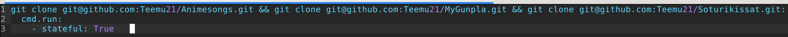

# H7 - Miniproject 

## By Teemu Koskinen

This file has all the steps how I accomplished this project and all the tests I did.

## Start 7.5.2022:

I will start this project by creating those three repositories I talked about before but I actually has to create just two because one of them already exist. 

The repositories that will be used in this project are Animesongs, Soturikissat and MyGunpla.

Let's test the main thing in this project that is the cloning multiple git repositories at the same time.

	$ git clone git@github.com:Teemu21/Animesongs.git git@github.com:Teemu21/Soturikissat.git git@github.com:Teemu21/MyGunpla.git
	
Let's test this.

	$ git clone git@github.com:Teemu21/Animesongs.git git@github.com:Teemu21/Soturikissat.git git@github.com:Teemu21/MyGunpla.git
	fatal: Too many arguments.
	
	usage: git clone [<options>] [--] <repo> [<dir>]
	
	    -v, --verbose         be more verbose
	    -q, --quiet           be more quiet
	    --progress            force progress reporting
	    -n, --no-checkout     don't create a checkout
	    --bare                create a bare repository
	    --mirror              create a mirror repository (implies bare)
	    -l, --local           to clone from a local repository
	    --no-hardlinks        don't use local hardlinks, always copy
	    -s, --shared          setup as shared repository
	    --recurse-submodules[=<pathspec>]
	                          initialize submodules in the clone
	    --recursive ...       alias of --recurse-submodules
	    -j, --jobs <n>        number of submodules cloned in parallel
	    --template <template-directory>
	                          directory from which templates will be used
	    --reference <repo>    reference repository
	    --reference-if-able <repo>
	                          reference repository
	    --dissociate          use --reference only while cloning
	    -o, --origin <name>   use <name> instead of 'origin' to track upstream
	    -b, --branch <branch>
	                          checkout <branch> instead of the remote's HEAD
	    -u, --upload-pack <path>
	                          path to git-upload-pack on the remote
	    --depth <depth>       create a shallow clone of that depth
	    --shallow-since <time>
	                          create a shallow clone since a specific time
	    --shallow-exclude <revision>
	                          deepen history of shallow clone, excluding rev
	    --single-branch       clone only one branch, HEAD or --branch
	    --no-tags             don't clone any tags, and make later fetches not to follow them
	    --shallow-submodules  any cloned submodules will be shallow
	    --separate-git-dir <gitdir>
	                          separate git dir from working tree
	    -c, --config <key=value>
	                          set config inside the new repository
	    --server-option <server-specific>
	                          option to transmit
	    -4, --ipv4            use IPv4 addresses only
	    -6, --ipv6            use IPv6 addresses only
	    --filter <args>       object filtering
	    --remote-submodules   any cloned submodules will use their remote-tracking branch
	    --sparse              initialize sparse-checkout file to include only files at root

Seems like that cloning multiple repositories even bt hand isn't as easy as I thought it would be.

After looking info in the internet I found out that you have to use && git clone to clone multiple git repositories in their own directories.

	$ git clone git@github.com:Teemu21/Animesongs.git && git clone git@github.com:Teemu21/Soturikissat.git && git clone git@github.com:Teemu21/MyGunpla.git
	Cloning into 'Animesongs'...
	remote: Enumerating objects: 276, done.
	remote: Counting objects: 100% (119/119), done.
	remote: Compressing objects: 100% (80/80), done.
	remote: Total 276 (delta 78), reused 80 (delta 39), pack-reused 157
	Receiving objects: 100% (276/276), 34.40 KiB | 617.00 KiB/s, done.
	Resolving deltas: 100% (179/179), done.
	Cloning into 'Soturikissat'...
	remote: Enumerating objects: 4, done.
	remote: Counting objects: 100% (4/4), done.
	remote: Compressing objects: 100% (4/4), done.
	remote: Total 4 (delta 0), reused 0 (delta 0), pack-reused 0
	Receiving objects: 100% (4/4), 7.40 KiB | 7.40 MiB/s, done.
	Cloning into 'MyGunpla'...
	remote: Enumerating objects: 4, done.
	remote: Counting objects: 100% (4/4), done.
	remote: Compressing objects: 100% (4/4), done.
	remote: Total 4 (delta 0), reused 0 (delta 0), pack-reused 0
	Receiving objects: 100% (4/4), 7.37 KiB | 7.37 MiB/s, done.
	$ ls
	 Animesongs      Desktop     Downloads   hello.py    jerryngittesti   Music        MyGunpla   Projekti2   Soturikissat   teemu2.txt   Templates            Videos
	 apachemoduuli   Documents   hello       important   Linux-HomeWork   MyGitRepos   Pictures   Public      teemu          teemuntyö   'UFW Salt tila.png'

This way it seems to be working but I also found out about the program called repo that's suppose to help with multiple git repositories. I tried to install this "repo" program but I couldn't get it to work. 

## 13.5.2022:

Now that the main thing of this project can be done by hand let's try to make the Salt state of this command. I went to [Salt's](https://docs.saltproject.io/en/latest/ref/states/all/salt.states.cmd.html) own site to find info about cmd.run because I wanted to test how I could make git clone command an Salt state that doesn't change if I run it second time and I found about stateful argument that I believe will make it so that it won't try to clone my git repos again. My init.sls file looks like this:

 

Let's test this state.

After testing this state I realized that it was useless because for some reason using Salt to clone git repo by SSH causes Permission Denied (publickey) error and after few hours looking into it I couldn't find any solution to this problem. Then I tried to clone it by using Git HTTPS and it kinda worked. I managed to clone the repository but it had wrong permissions. Basically only root user could do anything in that github repo. This was a big problem because after lot of trial and error I realized that even mode 777 in init.sls file didn't change the permissions. Then I tried to change them by hand and surprise surprise chmod worked but when I tried git add . command without sudo it gave me permission denied error. After this I realized that only way forward in this project was a shell script that would be runned on the minion manually after copying it from master to minions. Then the problem arose. How to run shell scripts on Windows? After a while I found a solution. Install Linux on Windows and I found perfect guide to it from [FOSS](https://itsfoss.com/install-bash-on-windows/). This guide is bit old if you are using Windows 11 but it works on it too. Tomorrow if I have time I will install Salt on my Ubuntu on Windows and day would be 14.5.2022.  

## 15.5.2022:

After running issues making Windows Subsystem for Linux to Salt minion. I realized that with WSL and Ubuntu installed that I could now use bash in normal Windows as well making in easy to copy and use shell scripts on Windows. FOSS guide for installing WSL and Ubuntu is good but to use git for cloning you will have to install SSH on your WSL machine and run ssh-keygen command. After this add your WSL machine's publickey to your Github. Otherwise it gives permission denied (publickey) error when trying to clone something by using shell script on Windows. These issues with Salt minion were there because my Salt master is in homenetwork which works in every situaion if all your minions are connected to same network but WSL has it's own virtual network so my master couldn't never find it and I tried change in it but it resulted in no connection to internet on the WSL machine. If your master is in an actual public ip address then Salt minion should work just fine. 

