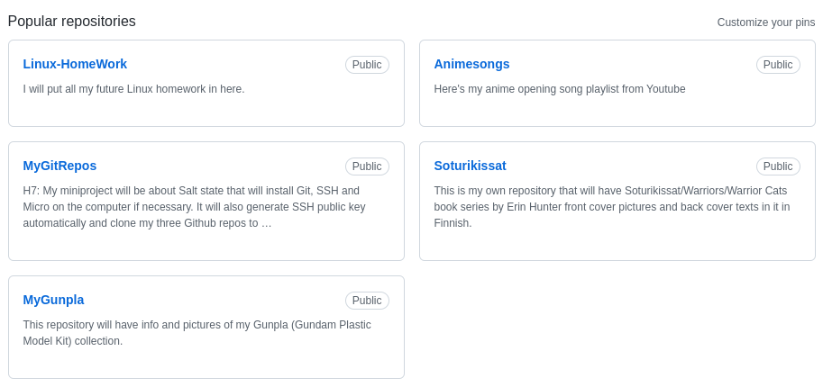

# MyGitRepos
H7: My miniproject will be about Salt state that will install Git, SSH and Micro on the computer if necessary. It will also generate SSH public key automatically and clone my three Github repos to be ready on that computer when I want to edit those three repos. This state is meant to be working on both Windows and Linux distributions. This state is mainly for my own use but if someone has multible Github repos that you want to edit on the new computer then my state might help you too. 

# State:

This project is currently in ALPHA state.

# Start 7.5.2022:

I will start this project by creating those three repositories I talked about before but I actually has to create just two because one of them already exist. 

The repositories that will be used in this project are Animesongs, Soturikissat and MyGunpla.

